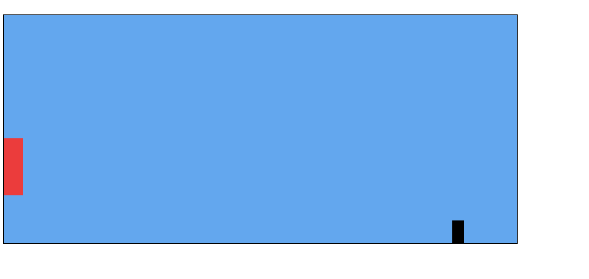

# jump_game
This a game built using HTML,CSS and Javascript.
Here keydown event listener is used in JS and animations in CSS for the continuous motion of black box. 
The game ends when front of red box collides with black box. 
Press any key to jump and avoid the collision.

